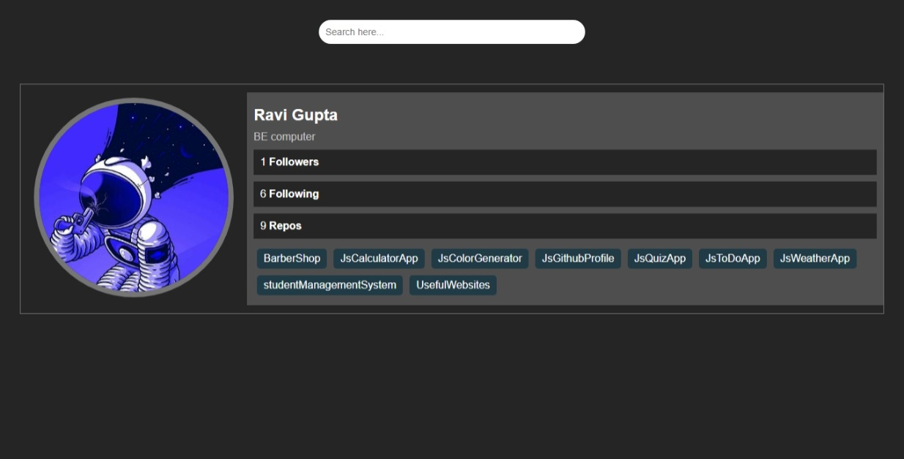

## JsGithubProfile 💻

This project is a simple yet elegant GitHub profile viewer built using JavaScript, HTML, and CSS. It fetches user information and repository data from the GitHub API and displays it in a visually appealing card.

**Here's a breakdown of the project's features:**

- **Search Functionality:** Search for any GitHub user by their username.
- **User Profile Display:** Presents the user's avatar, name, bio, followers count, following count, and number of public repositories.
- **Repository List:** Displays a list of the user's repositories with clickable links to their GitHub pages.
- **Clean and Responsive Design:** Built with a clean and minimalist design that adapts well to different screen sizes.

**🚀 Demo & Code:**

- **[Live Demo](https://gupta-ravi.github.io/JsGithubProfile/)** 
- **[GitHub Repository](https://github.com/Gupta-Ravi/JsGithubProfile)**

**📺 YouTube Tutorial**

[Click here to watch the tutorial](https://youtu.be/OEyZx0KttgY?si=cg2TCu94ryJ3v9AY)

**Let's take a look at it in action:**

**💡 Getting Started**

1. **Clone the repository:** `git clone https://github.com/Gupta-Ravi/JsGithubProfile`
2. **Open `index.html` in your browser.**

**🙌 Contributing:**

Contributions are always welcome! Feel free to open an issue or submit a pull request.

**Enjoy using this tool!** 😊